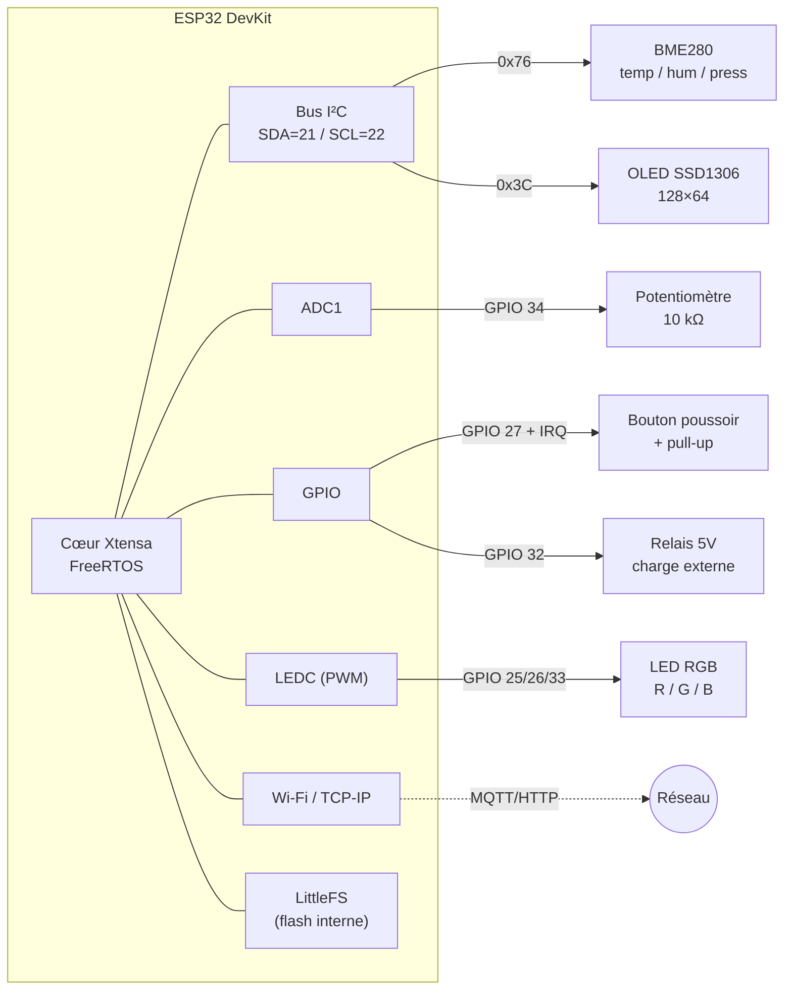
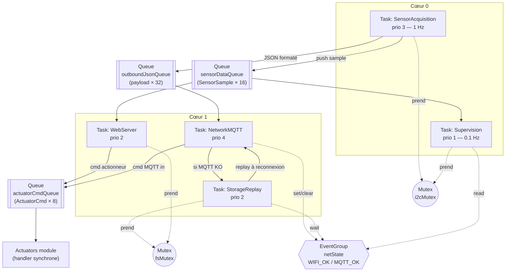

# esp32-secure-iot-station

Station IoT autonome et sécurisée pour bâtiments techniques, basée sur ESP32 + FreeRTOS.
Projet du module **Système IoT** — Master II.

## Objectifs

- Acquisition multi-capteurs avec filtrage, timestamp et détection d'aberrations
- Communication MQTT robuste (QoS ≥ 1, reconnexion auto, LWT)
- Stockage local et retransmission en cas de perte réseau
- Interface Web embarquée (config + commandes + live)
- Intégration Node-RED (dashboard, NoSQL) + bonus Grafana / InfluxDB
- Mécanismes de sécurité (auth MQTT, validation JSON, protection API)
- Supervision système (heap, uptime, latence) sur OLED + série

## Matériel

| Composant | Rôle | Interface |
|---|---|---|
| ESP32 DevKit | MCU | — |
| BME280 | Température / Humidité / Pression | I²C |
| OLED SSD1306 | Affichage supervision | I²C |
| Potentiomètre | Seuil réglable | ADC |
| Bouton poussoir | Acquittement / config | GPIO + IRQ |
| LED RGB | Indicateur d'état | PWM |
| Relais 5 V | Actionneur (ventilation / éclairage) | GPIO |

## Architecture matérielle



## Architecture logicielle (FreeRTOS)



## Flux de données end-to-end


## Structure du projet

```
src/
  main.cpp
  sensors/      # acquisition + filtrage + sanity check
  actuators/    # LED RGB, relais, OLED
  network/      # MQTT (PubSubClient) + Wi-Fi
  storage/      # LittleFS + buffer offline + replay
  web/          # AsyncWebServer + API
  security/     # auth, validation JSON, token API
data/
  index.html
  app.js
  style.css
```

## Contrat MQTT

- **Topic publish** : `campus/<groupe>/<deviceID>/data`
- **Topic subscribe (commandes)** : `campus/<groupe>/<deviceID>/cmd`
- **QoS** : 1 minimum
- **Auth** : user / password
- **Payload** (format imposé) :

```json
{
  "device": "ESP32-X",
  "ts": 0,
  "data": {
    "temp": 0,
    "humidity": 0
  }
}
```

## Badges visés

| Badge | Critère |
|---|---|
| 🟢 Sensor Engineer | Acquisition fiable + filtrage |
| 🔵 Network Engineer | MQTT robuste |
| 🟠 Embedded Architect | Multitâche propre |
| 🔴 Security Engineer | Validation + auth |
| 🟣 Full-Stack IoT | Web + Node-RED |
| ⚫ Reliability Engineer | Survit aux pannes |
| 🟡 Performance Engineer | Optimisation mémoire |

Bonus : **Grafana** (historisation + dashboard + alerte).

## Stack

- **Firmware** : PlatformIO + Arduino-ESP32 + FreeRTOS
- **MQTT** : PubSubClient
- **JSON** : ArduinoJson
- **Capteurs** : Adafruit BME280
- **OLED** : U8g2
- **Web** : ESPAsyncWebServer + AsyncTCP
- **Serveur** : Node-RED + MongoDB
- **Bonus** : InfluxDB + Grafana
