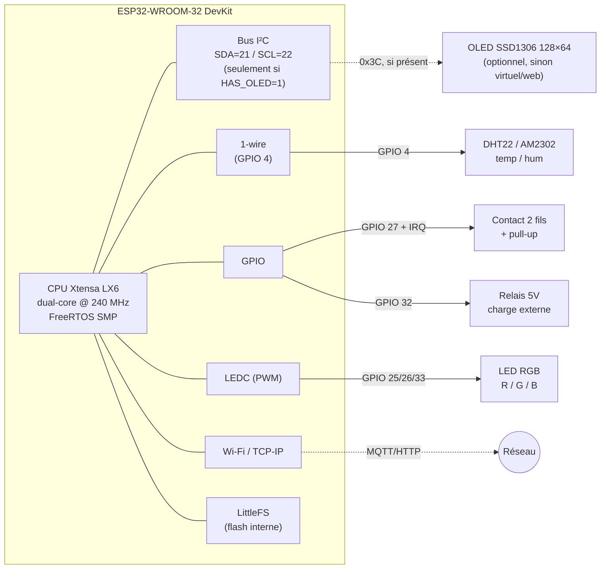
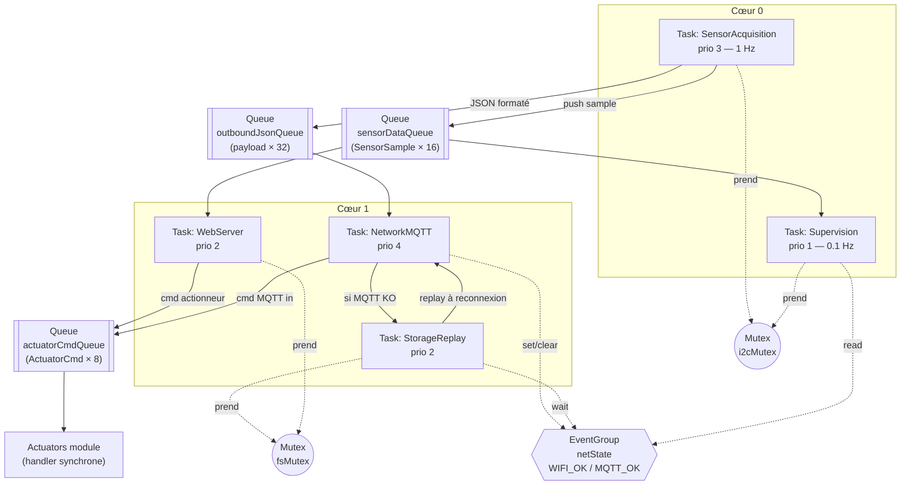
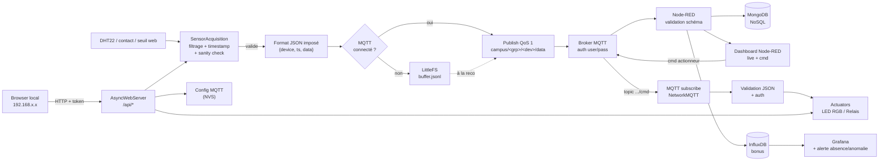

# esp32-secure-iot-station

Station IoT autonome et sécurisée pour bâtiments techniques, basée sur ESP32 + FreeRTOS.
Projet du module **Système IoT** — Master II.

## Objectifs

- Acquisition multi-capteurs avec filtrage, timestamp et détection d'aberrations
- Communication MQTT robuste (QoS ≥ 1, reconnexion auto, LWT)
- Stockage local et retransmission en cas de perte réseau
- Interface Web embarquée (config + commandes + live)
- Intégration Node-RED (dashboard, NoSQL) + bonus Grafana / InfluxDB
- Mécanismes de sécurité (auth MQTT, validation JSON, protection API)
- Supervision système (heap, uptime, latence) sur OLED + série

## Matériel

| Composant | Rôle | Interface |
|---|---|---|
| ESP32-WROOM-32 DevKit | MCU (Xtensa LX6 dual-core) | — |
| DHT22 (AM2302) | Température / Humidité | 1-wire (GPIO) |
| Contact 2 fils | Acquittement / config (fils à toucher) | GPIO + IRQ |
| LED RGB | Indicateur d'état | PWM |
| Relais 5 V | Actionneur (ventilation / éclairage) | GPIO |
| ~~OLED SSD1306~~ → **OLED virtuel** | Affichage supervision (Serial + panneau web) | logiciel (`HAS_OLED=0`) |
| ~~Potentiomètre~~ → **seuil web** | Seuil réglable | slider UI (NVS) |

> **Substituts matériels** (composants non disponibles) :
> - **OLED SSD1306 absent** → supervision diffusée sur le **port série** + un **OLED virtuel** dans l'UI web (panneau monochrome reproduisant l'écran 128×64). Le pilote **U8g2** reste intégré : brancher un vrai écran = passer `HAS_OLED=1` dans `platformio.ini`, sans autre modification.
> - **Potentiomètre absent** → le « seuil réglable » est piloté par un **slider** dans l'UI web (persisté en NVS), conservant la sémantique d'entrée analogique sans bruit ADC.
> - **DHT22 conservé** : capteur 1-wire sur GPIO (jamais sur l'I²C). Comme l'OLED virtuel n'utilise pas l'I²C non plus, **aucun périphérique I²C n'est requis** par défaut.

## Architecture matérielle



## Architecture logicielle (FreeRTOS)



## Flux de données end-to-end



## Structure du projet

```
src/
  main.cpp
  sensors/      # acquisition + filtrage + sanity check
  actuators/    # LED RGB, relais, OLED
  network/      # MQTT (PubSubClient) + Wi-Fi
  storage/      # LittleFS + buffer offline + replay
  web/          # AsyncWebServer + API
  security/     # auth, validation JSON, token API
data/
  index.html
  app.js
  style.css
```

## Contrat MQTT

- **Topic publish** : `campus/<groupe>/<deviceID>/data`
- **Topic subscribe (commandes)** : `campus/<groupe>/<deviceID>/cmd`
- **QoS** : 1 minimum
- **Auth** : user / password
- **Payload** (format imposé) :

```json
{
  "device": "ESP32-X",
  "ts": 0,
  "data": {
    "temp": 0,
    "humidity": 0
  }
}
```

## Badges visés

| Badge | Critère |
|---|---|
| 🟢 Sensor Engineer | Acquisition fiable + filtrage |
| 🔵 Network Engineer | MQTT robuste |
| 🟠 Embedded Architect | Multitâche propre |
| 🔴 Security Engineer | Validation + auth |
| 🟣 Full-Stack IoT | Web + Node-RED |
| ⚫ Reliability Engineer | Survit aux pannes |
| 🟡 Performance Engineer | Optimisation mémoire |

Bonus : **Grafana** (historisation + dashboard + alerte).

## Stack

- **Firmware** : PlatformIO (platform `pioarduino`) + Arduino-ESP32 core 3.x + FreeRTOS
- **MQTT** : PubSubClient
- **JSON** : ArduinoJson
- **Capteur** : DHT22 / AM2302 (lib DHTesp, provisoire — cf. tâche #2)
- **OLED** : U8g2
- **Web** : ESPAsyncWebServer + AsyncTCP
- **Serveur** : Node-RED + MongoDB
- **Bonus** : InfluxDB + Grafana

## Schéma de câblage (breadboard)

Câblage basé sur les broches figées dans `src/config.h`. Le « LED RGB » est réalisé
avec **3 LEDs discrètes** (rouge / verte / bleue), une par sortie PWM. L'OLED et le
potentiomètre étant absents, ils n'apparaissent pas (OLED virtuel + seuil web).

### Table de connexions (netlist)

| Composant | Broche | → ESP32 | Via |
|---|---|---|---|
| DHT22 | VCC | 3V3 | rail **+** |
| DHT22 | DATA | **GPIO4** | + pull-up **10 kΩ** vers 3V3 |
| DHT22 | GND | GND | rail **−** |
| LED rouge | anode (+) | **GPIO25** | résistance **330 Ω** |
| LED verte | anode (+) | **GPIO26** | résistance **330 Ω** |
| LED bleue | anode (+) | **GPIO33** | résistance **330 Ω** |
| LEDs | cathode (−) | GND | rail **−** |
| Relais | IN / SIG | **GPIO32** | — (3,3 V suffit sur module opto) |
| Relais | VCC | 5V (VIN) | rail **+** bas |
| Relais | GND | GND | rail **−** |
| Contact 2 fils | fil A | **GPIO27** | — |
| Contact 2 fils | fil B | GND | (pull-up **interne**, pas de résistance) |

### Schéma fonctionnel (ASCII)

```
                         ESP32-WROOM-32 DevKit
                        +------------------------+
            3V3  o------|3V3                  VIN|------o 5V  (-> relais VCC)
            GND  o------|GND                  GND|------o GND
                        |                        |
   DHT22 DATA  <--------|GPIO4              GPIO32|-------->  RELAIS IN
                        |                        |
   LED R  <------------ |GPIO25             GPIO26|-------------> LED G
                        |                        |
   LED B  <------------ |GPIO33             GPIO27|<-----  CONTACT (fil A)
                        +------------------------+

   Légende fils :  <--- sortie ESP32 (commande)     ---< entrée ESP32 (lecture)
```

### Détail par composant (avec résistances)

```
 DHT22 (3 fils utiles)                LEDs (cathode commune -> GND)
 ---------------------                -----------------------------
   3V3 ──┬──────────────┐             GPIO25 ──[330Ω]──▶|──┐
         │            [10kΩ]          GPIO26 ──[330Ω]──▶|──┤
         │              │             GPIO33 ──[330Ω]──▶|──┤
   VCC ──┘   DATA ──────┴── GPIO4                         │
   GND ───────────────────── GND                         GND
   (pull-up 10kΩ inutile si        ▶|  = LED : anode ─▶|─ cathode
    le module DHT22 l'intègre)         (sens passant vers la masse)

 RELAIS 5V (module opto-isolé)        CONTACT 2 fils (ex-bouton)
 ----------------------------         --------------------------
   VIN(5V) ── VCC                       GPIO27 ── fil A
   GND ────── GND                       GND ───── fil B
   GPIO32 ─── IN                        (INPUT_PULLUP : fils en
   charge 230V/DC sur COM + NO/NC        contact => niveau BAS lu)
```

### Disposition sur breadboard

**Orientation réelle** : la **longueur** porte les colonnes **1 → 60** ; la **largeur**
porte les lignes **A B C D E** (banc haut) et **F G H I J** (banc bas), séparées par la
**rainure centrale**. Les **rails ± courent sur la longueur**, en haut ET en bas.

**Règle électrique** : dans une même colonne, les 5 trous **A-E sont reliés** entre eux,
et **F-J** entre eux ; la rainure isole les deux bancs. Donc *deux pattes dans la même
colonne (même banc) = connectées*.

```
   Colonnes  1 ─────────────────────────────────────────────────► 60
  ┌────────────────────────────────────────────────────────────────┐
+ │ ════════════════════ rail + (3V3) ════════════════════════════  │  rails
− │ ──────────────────── rail − (GND) ────────────────────────────  │  HAUT
  ├────────────────────────────────────────────────────────────────┤
A │ ·  ·  ·  ·  ·  ·  ·  ·  ·  ·  ·  ·  ·  ·  ·  ·  ·  ·  ·  ·  ·  ·  │ ┐
B │ ·  ╔══════════════════════════════════════╗  ·  ·  ·  ·  ·  ·   │ │ banc
C │ ·  ║                                      ║  ·  ·  ·  ·  ·  ·   │ │ HAUT
D │ ·  ║       ESP32-WROOM-32  (header haut)  ║  ·  ·  ·  ·  ·  ·   │ │ (A-E
E │ ·  ║                                      ║  ·  ·  ·  ·  ·  ·   │ ┘ reliés)
  │ ·  ╟──────────── rainure centrale ────────╢  · · · · · · · · ·  │
F │ ·  ║       ESP32-WROOM-32  (header bas)   ║  ·  ·  ·  ·  ·  ·   │ ┐
G │ ·  ║                                      ║  ·  ·  ·  ·  ·  ·   │ │ banc
H │ ·  ╚══════════════════════════════════════╝  ·  ·  ·  ·  ·  ·   │ │ BAS
I │ ·  ·  ·  ·  ·  ·  ·  ·  ·  ·  ·  ·  ·  ·  ·  ·  ·  ·  ·  ·  ·  ·  │ │ (F-J
J │ ·  ·  ·  ·  ·  ·  ·  ·  ·  ·  ·  ·  ·  ·  ·  ·  ·  ·  ·  ·  ·  ·  │ ┘ reliés)
  ├────────────────────────────────────────────────────────────────┤
+ │ ════════════════════ rail + (5V/VIN) ═════════════════════════  │  rails
− │ ──────────────────── rail − (GND) ────────────────────────────  │  BAS
  └────────────────────────────────────────────────────────────────┘
   ← zone ESP32 (enjambe la rainure) →     ← colonnes libres composants →
```

> **Méthode de pose** :
> - L'ESP32 **enjambe la rainure** : son header du dessus occupe le banc **A-E**, celui
>   du dessous le banc **F-J** (le corps large couvre C-G). Pour atteindre une broche,
>   on pique un cavalier dans le **trou libre de SA colonne** : ligne **A** (banc haut)
>   ou lignes **I/J** (banc bas).
> - **Rails** : amène `3V3`, `5V/VIN` et `GND` de l'ESP32 vers les rails ± (haut/bas),
>   puis alimente chaque composant depuis le rail le plus proche.
> - **LED** (×3) : `GPIO25/26/33` → **330 Ω** → anode → cathode → rail **−**.
> - **DHT22** : `VCC`→rail +(3V3), `GND`→rail −, `DATA`→`GPIO4` **+ 10 kΩ vers 3V3**
>   (résistance inutile si le module l'intègre déjà).
> - **Relais** : `VCC`→rail +(5V), `GND`→rail −, `IN`→`GPIO32`.
> - **Contact** : un fil→`GPIO27`, l'autre→rail − (**aucune** résistance : pull-up interne).

### Liste des résistances (BOM)

| Quantité | Valeur | Rôle |
|---|---|---|
| 3 | **330 Ω** (220–470 Ω accepté) | limitation courant LEDs R/G/B |
| 1 | **10 kΩ** | pull-up DATA DHT22 (si non intégré au module) |

> **Variante relais « nu » (sans module driver)** : ajouter un transistor NPN
> (ex. 2N2222/BC547) piloté par `GPIO32` via une **résistance de base 1 kΩ**, plus
> une **diode de roue libre 1N4007** en antiparallèle sur la bobine. Avec un module
> relais tout intégré (recommandé), rien de tout ça : IN / VCC / GND suffisent.
>
> **LED RGB commune-anode** : si tu utilises une LED RGB à anode commune au lieu de
> 3 LEDs séparées, relie l'anode au 3V3 et la logique PWM est **inversée** (0 = allumé).
