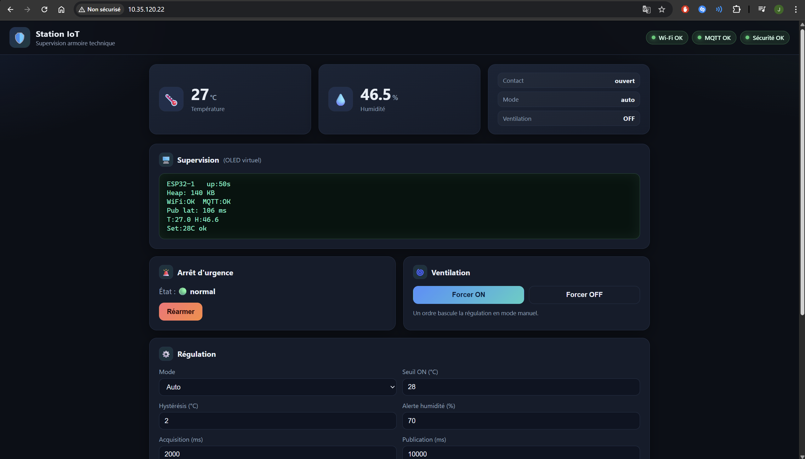
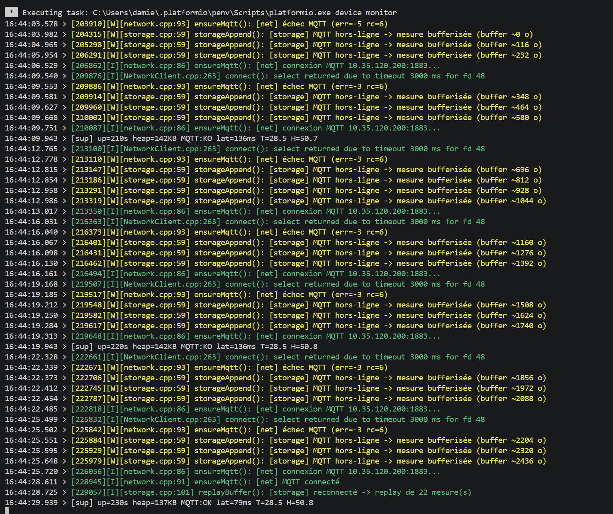
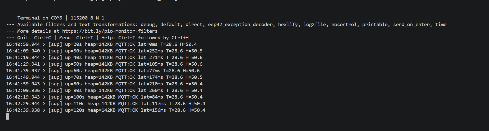
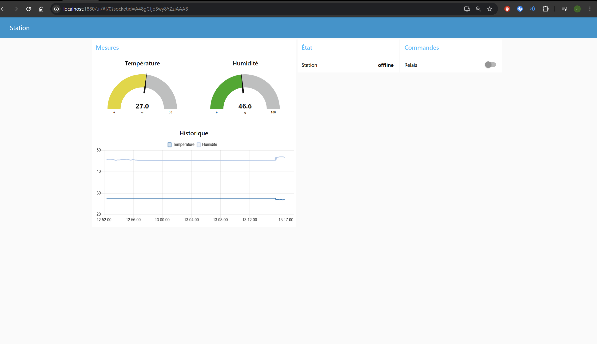
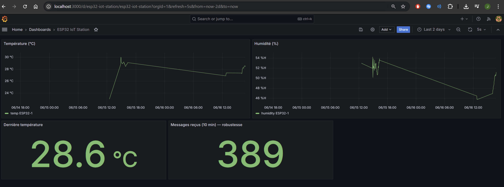

# Rapport technique : Station IoT sécurisée et autonome

**Module** : Système IoT · Master II · **Cible** : ESP32-WROOM-32 + FreeRTOS
**Dépôt** : `esp32-secure-iot-station` · **Groupe** : g1 · **Device** : ESP32-1

> 📄 *Document de synthèse (≤ 5 pages). Le câblage détaillé est dans
> [`SETUP.md`](SETUP.md), l'architecture complète dans
> [`SPEC-TECHNIQUE.md`](SPEC-TECHNIQUE.md), le contexte métier dans
> [`SPEC-METIER.md`](SPEC-METIER.md).*

---

## 1. Contexte & objectif

La station supervise une **armoire technique** (local contenant des équipements
sensibles à la chaleur). Elle doit : mesurer température/humidité, **réguler la
ventilation** par seuil, signaler son état, offrir un **arrêt d'urgence**,
remonter ses données à un serveur central, et **continuer à fonctionner même
réseau coupé**. L'enjeu transverse est la **fiabilité** (autonomie en cas de
panne) et la **sécurité** (auth + validation des entrées).


*Figure 1 : montage réel de la station sur breadboard.*

---

## 2. Architecture logicielle

Le firmware respecte le découpage modulaire imposé (`src/sensors`, `actuators`,
`network`, `storage`, `web`, `security`, plus `control` et `supervision`).
`loop()` est **vide** (un simple `vTaskDelay`) : toute la logique vit dans
**8 tâches FreeRTOS** épinglées sur les 2 cœurs, communiquant par **queues**,
**mutex** et **event-groups** : aucun état mutable partagé sans protection.


*Figure 2 : répartition des 8 tâches FreeRTOS sur les 2 cœurs et leurs canaux de communication.*

| Tâche | Prio | Cœur | Rôle |
|---|---|---|---|
| `Safety` | 5 | 0 | Arrêt d'urgence (réveil par sémaphore donné en ISR) |
| `NetworkMQTT` | 4 | 1 | Wi-Fi + MQTT (reconnexion, publication, commandes) |
| `SensorAcq` | 3 | 0 | Acquisition DHT22 + contact |
| `Control` | 3 | 0 | Régulation ventilation (hystérésis) + voyants d'état |
| `WebServer` | 2 | 1 | API + UI embarquée |
| `StorageReplay` | 2 | 1 | Rejeu du buffer offline |
| `Telemetry` | 2 | 1 | Publication périodique découplée |
| `Supervision` | 1 | 0 | heap / uptime / latence |

**Hiérarchie des priorités** : *sécurité > réseau > métier temps réel > confort >
observation*. Les priorités reflètent **l'ordre de passage en cas de conflit**,
pas une vitesse d'exécution. La répartition cœurs isole le temps réel local
(cœur 0) des piles réseau potentiellement bloquantes (cœur 1).

**Primitives de synchronisation utilisées** :
- **Queues** : `actuatorCmdQueue` (web/MQTT → régulation), `outboundJsonQueue`
  (télémétrie → réseau).
- **Mutex** : cache mesure (`sensorsGetLatest`), LittleFS, trame OLED.
- **Event-groups** : `netState` (WIFI_OK / MQTT_OK), `appState` (ESTOP).
- **Sémaphore binaire** : `estopSem`, donné par l'**ISR du contact** pour
  réveiller `Safety` (réaction < 50 ms).

---

## 3. Acquisition fiable des capteurs

Chaque mesure DHT22 est : **filtrée** (moyenne glissante sur 8 échantillons),
**horodatée** (epoch NTP, repli sur l'uptime si non synchronisé), et soumise à
une **détection d'aberrations** (bornes −40..80 °C / 0..100 %). Les valeurs hors
bornes sont marquées `valid=false` et **ne polluent pas le filtre**. Le dernier
échantillon est diffusé via un **cache protégé par mutex** (lu par
régulation / web / télémétrie / supervision).

---

## 4. Régulation & actionneurs

Régulation **par hystérésis** (défauts : ON ≥ 28 °C, OFF ≤ 26 °C) pilotant le
relais de ventilation. Deux modes (`auto` / `manuel`) ; une commande manuelle
bascule automatiquement en `manuel`. Les **3 LEDs discrètes** servent de voyants
d'état exclusifs : 🟢 nominal · 🟠 ventilation active ou humidité haute ·
🔴 défaut capteur / arrêt d'urgence (clignotant). Les seuils et périodes sont
**modifiables à chaud** via l'UI web et **persistés en NVS**.


*Figure 3 : interface web embarquée (mesures live, régulation, OLED virtuel).*

---

## 5. Communication MQTT & mode offline

Publication sur `campus/g1/ESP32-1/data` en **QoS 1**, avec **LWT retained**
(`status`), **reconnexion automatique** et **souscription aux commandes**
(`cmd`). Le format JSON imposé est respecté, enrichi de champs métier :

```json
{ "device": "ESP32-1", "ts": 0, "data": { "temp": 0, "humidity": 0 },
  "estop": false, "relay": true, "mode": "auto" }
```

**Mode offline (fiabilité)** : si MQTT est indisponible, chaque mesure est
**bufferisée** en JSONL sur LittleFS (compaction au-delà de 256 Ko). À la
reconnexion, le buffer est **renommé `.replay`** (les nouvelles mesures vont dans
un buffer neuf → zéro perte) puis **rejoué** en QoS 1, garantissant une livraison
*at-least-once*.


*Figure 4 : scénario de panne — mesures bufferisées hors-ligne puis rejouées à la
reconnexion (livraison sans perte).*

---

## 6. Sécurité

- **Auth MQTT** user/password (broker Mosquitto, `allow_anonymous false`).
- **Validation JSON** des commandes entrantes : parsing strict, type vérifié,
  rejet des payloads > 200 o, seule la commande `relay` est acceptée.
- **API web** protégée par **token Bearer** comparé en **temps quasi constant**
  (anti timing-attack) ; seuls les fichiers statiques de l'UI sont publics.
- Secrets isolés dans `include/secrets.h` (gitignoré).

---

## 7. Optimisation & supervision

La tâche `Supervision` affiche **périodiquement** (série + **OLED virtuel** web) :
**heap libre**, **uptime**, **latence de publication MQTT** (mesurée autour du
`publish`). Empreinte mesurée : **RAM ≈ 15 %**, **Flash ≈ 38 %** (partition
`huge_app.csv`, 3 Mo). Horloges : CPU 240 MHz, PWM LEDs 5 kHz, tick FreeRTOS 1 kHz.


*Figure 5 : supervision périodique sur le port série (heap, uptime, latence MQTT).*

---

## 8. Serveur central (Node-RED + bases) & bonus Grafana

Node-RED **reçoit** le MQTT, **valide le schéma**, **stocke en MongoDB**
(NoSQL), alimente un **dashboard** (jauges + historique) et **renvoie des
commandes** vers `cmd`. La stack est conteneurisée (`docker compose`) :
Mosquitto (auth), MongoDB, Node-RED, InfluxDB, Grafana.

**Bonus** : historisation dans **InfluxDB** + **dashboard Grafana** (état station,
mesures, actionneurs, métrique de robustesse) avec **alerte** sur absence de
données / anomalie capteur.


*Figure 6 : dashboard Node-RED (jauges, historique, commandes).*


*Figure 7 : dashboard Grafana (historisation InfluxDB) avec alerte configurée.*

---

## 9. Choix techniques & arbitrages

| Décision | Justification |
|---|---|
| **256dpi/arduino-mqtt** vs PubSubClient | QoS 1 réel (PubSubClient limité au QoS 0) |
| **pioarduino + core 3.x** | Le core Arduino-ESP32 officiel est resté en 2.x |
| **Cache + mutex** pour le live, **queues** pour commandes/sortie | "Dernière valeur" ≠ flux producteur/consommateur |
| **Partition `huge_app.csv`** | Marge applicative (Flash 38 %), large FS, pas d'OTA requis |
| **8 tâches sur 2 cœurs** | Découple les rythmes (0,5 Hz capteur / 10 s pub / web / estop) |

**Substitutions matérielles** (équivalences fonctionnelles, pas des manques) :
BME280 → **DHT22** · potentiomètre → **seuil web** (NVS) · bouton → **contact
2 fils** (même montage : entrée + pull-up + IRQ) · LED RGB → **3 LEDs discrètes**
(voyants d'état) · OLED SSD1306 → **OLED virtuel** (série + panneau web ; pilote
U8g2 conservé sous `HAS_OLED`).

---

## 10. Couverture des badges

| Badge | Preuve |
|---|---|
| 🟢 Sensor | Filtrage moyenne glissante + timestamp + bornes aberrantes (`sensors.cpp`) |
| 🔵 Network | QoS 1 + LWT + reconnexion + souscription `cmd` (`network.cpp`) |
| 🟠 Embedded | 8 tâches / 2 cœurs + queues/mutex/event-groups/ISR (`main.cpp`, `rtos_shared`) |
| 🔴 Security | Token temps-constant + validation JSON + auth MQTT (`security.cpp`) |
| 🟣 Full-Stack | UI embarquée + Node-RED + MongoDB (`web/`, `server/`) |
| ⚫ Reliability | Buffer LittleFS + replay `.replay` *at-least-once* + compaction (`storage.cpp`) |
| 🟡 Performance | heap / uptime / latence pub périodiques (`supervision.cpp`) |
| ★ Bonus | Historisation InfluxDB + dashboard Grafana + alerte |

---

## 11. Limites & perspectives

- **Sécurité transport** : MQTT en clair (auth seule). Évolution : **TLS** broker
  + certificats device.
- **Horloge** : timestamp NTP, repli uptime si NTP indisponible au boot.
- **OTA** : non activé (partition sans seconde app) ; possible en repassant sur
  un schéma de partition OTA au prix de l'espace applicatif.
- **Multi-stations** : le contrat de topic (`campus/<groupe>/<deviceID>`) et le
  flow Node-RED (wildcards `+`) supportent déjà la montée en charge.


*Figure 8 : flux end-to-end capteur → MQTT → Node-RED → bases → dashboards.*

---

# Annexe A : Réponses aux questions subsidiaires FreeRTOS

### A.1 : Scheduler, tâche vs fonction, `vTaskDelay()`, intérêt du multitâche
Le **scheduler** (ordonnanceur) de FreeRTOS décide quelle tâche tourne à un
instant donné. Il fonctionne par **priorités** : à chaque tick (1 ms) ou
événement, il donne la main à la tâche prête la plus prioritaire, sur les 2 cœurs
de l'ESP32. Différence **tâche / fonction** : une fonction s'exécute puis rend la
main avec `return` ; une **tâche** est un programme qui tourne en parallèle, avec
sa propre pile, sa priorité et une boucle sans fin. **`vTaskDelay()`** met la
tâche en pause **sans occuper le processeur** (contrairement à `delay()` qui le
bloque). Le **multitâche** est utile ici parce que nos traitements n'ont pas le
même rythme (DHT22 toutes les 2 s, publication toutes les 10 s, web à la demande,
arrêt d'urgence en moins de 50 ms) : avec une seule boucle, une reconnexion Wi-Fi
de plusieurs secondes bloquerait tout le reste, sécurité comprise.

### A.2 : `vTaskDelay(pdMS_TO_TICKS(1000));`
C'est l'instruction de notre `loop()`. `pdMS_TO_TICKS(1000)` convertit 1000 ms en
ticks (ici 1 tick = 1 ms). La tâche se met en pause pour 1 s : elle libère le
processeur, qui passe aussitôt à la tâche prête la plus prioritaire ; au bout
d'une seconde elle redevient exécutable. Pendant ce temps, les autres tâches
tournent normalement : c'est pourquoi notre `loop()` vide ne gêne rien. À noter :
`vTaskDelay` compte à partir du réveil, donc le rythme n'est pas parfaitement
régulier ; nos tâches qui doivent l'être utilisent `vTaskDelayUntil`.

### A.3 : Justification des priorités
L'ordre retenu : sécurité (5) > réseau (4) > métier temps réel (3) > confort (2) >
observation (1). Une priorité plus haute ne veut pas dire « plus rapide » : elle
dit juste **qui passe en premier** quand deux tâches veulent le processeur en même
temps. `Safety` est tout en haut car déclenchée par une interruption et doit
pouvoir interrompre n'importe quoi pour couper le relais ; `Supervision` est tout
en bas car elle ne fait qu'afficher des informations.

### A.4 : Pourquoi presque toujours un `vTaskDelay(...)`
Une tâche tourne dans une boucle sans fin. Si elle ne se met jamais en pause
(`vTaskDelay`, ou attente sur une queue / un sémaphore), elle occupe le processeur
à 100 % et empêche les autres de tourner, jusqu'au redémarrage par le watchdog.
Chez nous : `controlTask` se termine par un `vTaskDelay` ; `safetyTask` attend sur
son sémaphore (`xSemaphoreTake … portMAX_DELAY`) et ne consomme rien tant que
l'arrêt d'urgence n'est pas déclenché.

### A.5 : `TaskMQTT` avec `while(true){ mqtt.publish(...); }`
Problème : il n'y a **aucune pause**. Cette boucle publie en continu, sature le
processeur et le broker, et empêche les autres tâches de tourner (redémarrage
watchdog). Chez nous, `telemetryTask` prépare un message toutes les 10 s (avec
`vTaskDelayUntil`) et le dépose dans `outboundJsonQueue` ; `networkTask` le
récupère et le publie en QoS 1. Le rythme vient de la pause, pas d'une boucle qui
tourne à vide.

### A.6 : `TaskMQTT` prio 20 / `TaskSensors` prio 1 : meilleur ?
Non, et ça peut même casser le système. Si `TaskMQTT` (20) ne se met pas assez en
pause, elle passe systématiquement devant `TaskSensors` (1), qui ne tourne presque
plus : on publierait alors des valeurs jamais mises à jour. Une priorité élevée
n'accélère rien (le débit dépend du réseau). C'est pour ça que chez nous réseau (4)
et capteurs (3) sont proches, et que seul l'arrêt d'urgence est tout en haut (5).

### A.7 : Global `int temperature;` partagé : correct ?
Non. Deux tâches accèdent à la même variable sans protection. Même si un `int`
seul se lit d'un coup, notre structure `SensorSample` (température + humidité +
horodatage + indicateur de validité) peut être lue pile au milieu d'une écriture →
valeurs incohérentes. Notre solution : `sensorsGetLatest()` recopie la structure
complète sous mutex, donc on lit toujours un instantané cohérent.

### A.8 : Mutex / Queue / Sémaphore + quand Mutex plutôt que Queue
- **Mutex** : un verrou pour qu'une seule tâche à la fois utilise une ressource
  partagée (fichiers, cache, bus I²C).
- **Queue** : une file qui transmet des données d'une tâche à une autre en les
  recopiant (chez nous `actuatorCmdQueue` et `outboundJsonQueue`).
- **Sémaphore** : un simple signal entre tâches, sans données (`estopSem`, envoyé
  par l'interruption du contact pour réveiller `Safety`).

On prend un **mutex** pour protéger l'accès à une ressource ; une **queue** pour
transmettre une valeur d'un producteur à un consommateur.

### A.9 : `temp=read()` / `publish(temp)` : pourquoi une Queue
Avec une variable partagée, on a le risque d'incohérence (cf. A.7) et un problème
de timing : rien ne garantit que chaque mesure est publiée une fois et une seule.
Une queue règle les deux : les données sont recopiées proprement, le producteur et
le consommateur avancent chacun à leur rythme (si MQTT est lent, les messages
s'accumulent au lieu d'être écrasés), et la réception attend toute seule sans
boucle d'attente. C'est exactement notre chaîne `outboundJsonQueue` → publication
QoS 1, avec mise en mémoire sur LittleFS puis renvoi si le réseau était coupé.

### A.10 : Starvation + exemple
La **starvation** (famine) : une tâche prête à tourner n'a jamais le processeur
parce que des tâches plus prioritaires le monopolisent. Exemple (le scénario
d'A.6) : `NetworkMQTT` en priorité 20 sans pause passe sans arrêt devant
`SensorAcq` (3) et `Supervision` (1) → les capteurs ne sont plus lus, la
supervision se fige. On l'évite avec des priorités équilibrées et une pause dans
chaque boucle.

### A.11 : Pourquoi FreeRTOS plutôt qu'une boucle Arduino
(1) Plusieurs traitements bloquants en même temps (Wi-Fi/MQTT + web +
acquisition) ; (2) l'arrêt d'urgence doit réagir en moins de 50 ms, ce que seul un
système capable d'interrompre la tâche en cours garantit (`Safety` en priorité 5,
déclenchée par interruption) ; (3) on profite des 2 cœurs (temps réel local sur le
cœur 0, réseau sur le cœur 1) ; (4) des outils prêts à l'emploi pour partager les
données proprement (queues, mutex, sémaphores) ; (5) c'est demandé par le sujet.
Une simple boucle ne pourrait pas garantir la réactivité de la sécurité pendant
une reconnexion réseau tout en continuant à servir la page web.
