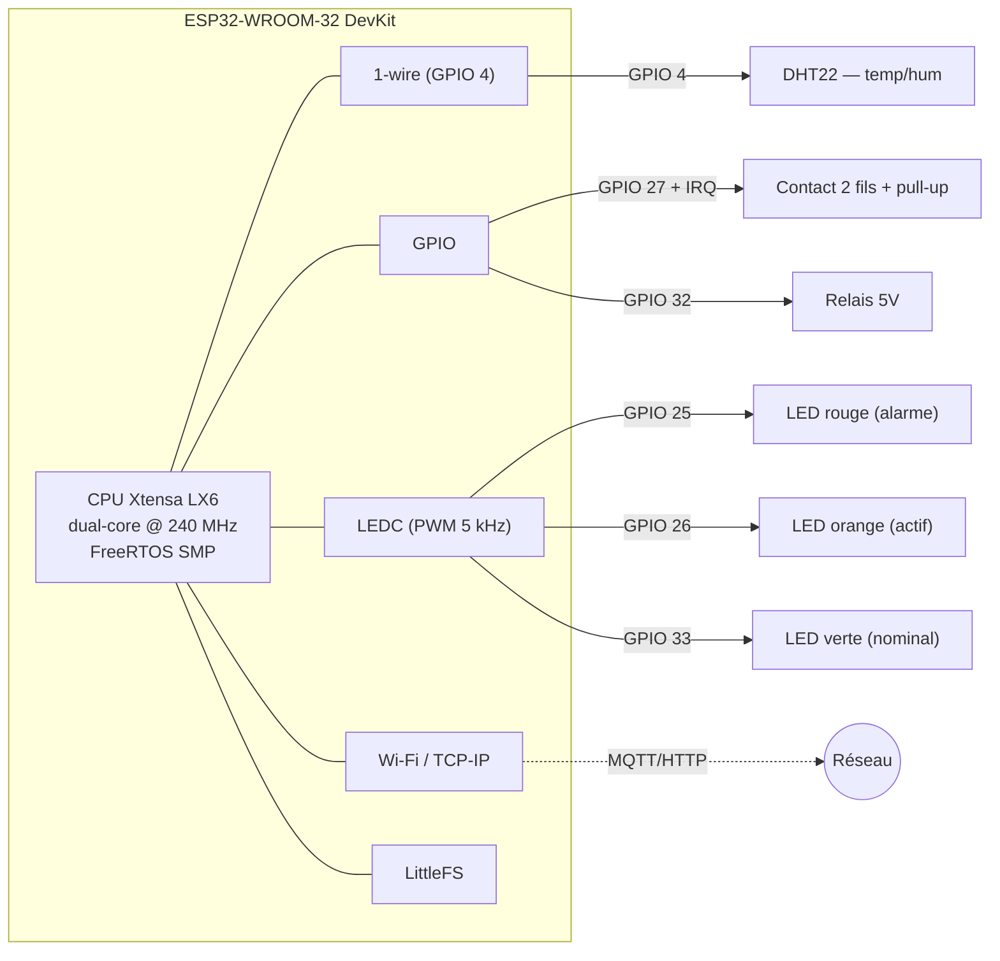
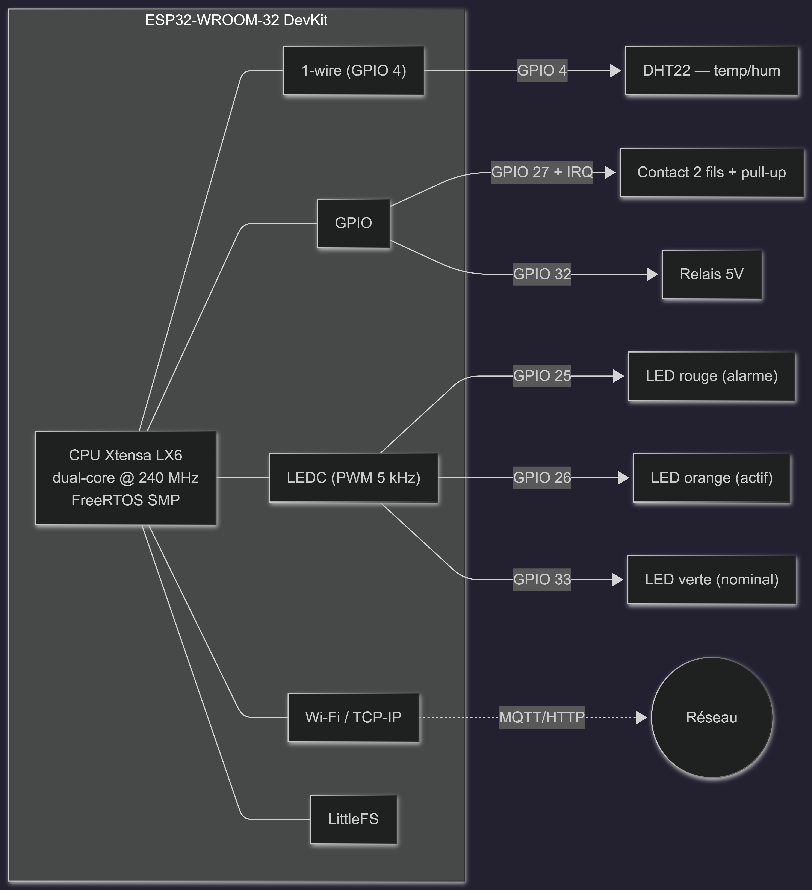
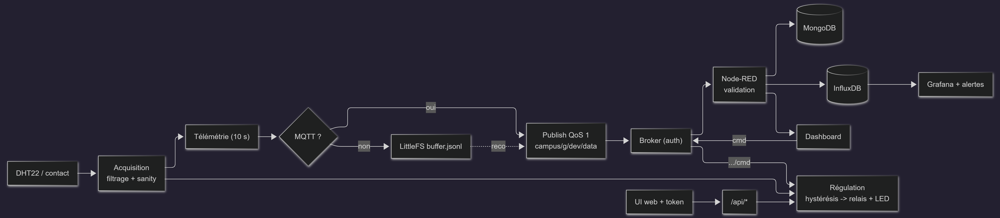

# Spécification technique

Référence technique du firmware et de son architecture. Pour le **contexte
métier** et le découpage fonctionnel des tâches, voir
[`SPEC-METIER.md`](SPEC-METIER.md). Pour la **mise en route**, voir
[`SETUP.md`](SETUP.md).

## Plateforme & stack

| Élément | Choix | Remarque |
|---|---|---|
| MCU | ESP32-WROOM-32 (Xtensa LX6 dual-core @ 240 MHz) | FreeRTOS SMP |
| Build | PlatformIO + platform **pioarduino** + Arduino-ESP32 **core 3.x** | core officiel limité au 2.x |
| MQTT | **256dpi/arduino-mqtt** (lwmqtt) | publish **QoS 1** (PubSubClient écarté : QoS 0 only) |
| JSON | ArduinoJson 7 | validation typée |
| Capteur | DHT22 / AM2302 — lib **DHTesp** | 1-wire, lecture 0,5 Hz |
| Web | **ESPAsyncWebServer** + AsyncTCP (fork *esp32async*) | API + UI statique |
| FS | **LittleFS** | UI `/data` + buffer offline |
| OLED | U8g2 (optionnel, `HAS_OLED`) | sinon OLED virtuel (web) |
| Partition | `huge_app.csv` (~3 Mo app) | pas d'OTA, large FS |

Empreinte : **RAM ~15 %**, **Flash ~38 %** (sur 3 Mo).

## Architecture matérielle



> OLED SSD1306 et potentiomètre absents → remplacés en logiciel (OLED virtuel
> web + seuil web). DHT22 en 1-wire → **aucun périphérique I²C requis** par défaut.

## Architecture logicielle (FreeRTOS)

8 tâches, communication par queues / mutex / event-groups (aucun état mutable
partagé sans protection).



## Flux de données end-to-end



## Structure du projet

```
src/
  main.cpp            # init + création des 8 tâches, loop() vide
  config.h            # pins, seuils, priorités/cœurs (compile-time)
  app_types.h         # types des queues (POD)
  runtime_config.*    # config modifiable à chaud (NVS) : régulation + MQTT
  rtos_shared.*       # queues, mutex, event-groups, estopSem
  sensors/            # DHT22 + contact (IRQ) + filtrage + cache
  control/            # régulation (relais/LED) + arrêt d'urgence
  actuators/          # LED RGB (LEDC) + relais
  network/            # Wi-Fi + MQTT (QoS1) + télémétrie + NTP
  storage/            # LittleFS : buffer offline + replay
  web/                # AsyncWebServer + API protégée par token
  security/           # token + validation JSON des commandes
  supervision/        # heap/uptime/latence -> série + OLED (réel/virtuel)
data/                 # index.html, app.js, style.css (UI servie depuis LittleFS)
```

## Contrat MQTT

- Publish : `campus/<groupe>/<deviceID>/data` — **QoS 1**
- Subscribe (commandes) : `campus/<groupe>/<deviceID>/cmd`
- Statut / LWT : `campus/<groupe>/<deviceID>/status` (retained)
- Auth : user / password
- Payload (format imposé, + champs métier additionnels) :

```json
{ "device": "ESP32-1", "ts": 0, "data": { "temp": 0, "humidity": 0 },
  "estop": false, "relay": true, "mode": "auto" }
```

## Sécurité

- **Auth MQTT** user/pass (broker Mosquitto, `allow_anonymous false`).
- **Validation JSON** des commandes : parsing strict, champs/types vérifiés,
  bornes (RGB 0..255), rejet des payloads > 200 o.
- **API web** protégée par **token Bearer** (comparaison en temps quasi
  constant) ; fichiers statiques publics pour charger l'UI.
- Secrets isolés dans `include/secrets.h` (gitignoré).

## Fiabilité (mode offline)

MQTT KO → chaque mesure est **bufferisée** en JSONL (LittleFS), avec compaction
au-delà de 256 Ko. À la reconnexion, **StorageReplay** rejoue le buffer
(renommé `.replay` pour zéro perte) → publication QoS 1 ⇒ *at-least-once*.

## Performance & horloges

| Horloge | Fréquence | Rôle |
|---|---|---|
| CPU | 240 MHz | firmware / FreeRTOS |
| Bus APB | 80 MHz | timers, UART… |
| PWM LEDC | 5 kHz / 8 bits | LEDs |
| Tick FreeRTOS | 1 kHz (1 ms) | `vTaskDelay` / ordonnanceur |

Supervision périodique : **heap libre**, **uptime**, **latence de publication
MQTT** (série + OLED virtuel). `loop()` est vide (`vTaskDelay`) — toute la
logique vit dans les tâches.

## Substituts matériels

| Manquant | Substitut |
|---|---|
| OLED SSD1306 | OLED **virtuel** (série + panneau web) ; pilote U8g2 conservé (`HAS_OLED=1`) |
| Potentiomètre | **seuil web** (`tempOn`) persisté NVS |
| Bouton | **contact 2 fils** (montage identique, GPIO27 + pull-up + IRQ) |
| LED RGB | **3 LEDs discrètes** rouge/orange/verte (voyants d'état) |
